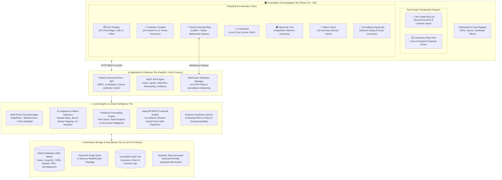
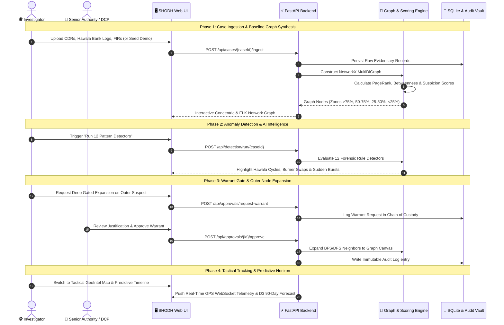

# SHODH — AI-Powered Criminal Network Analysis Platform (CNAP)
> **Law Enforcement Visual Intelligence Suite | 100% Air-Gapped Local Deployment | Zero Cloud & Zero External APIs**

[](https://github.com/YOGESH-BHANGALE/obsession)
[](https://fastapi.tiangolo.com)
[](https://react.dev)
[](https://www.sqlite.org)
[]()
[]()

---

## 📌 Executive Summary

**SHODH** (Criminal Network Analysis Platform — CNAP) is an offline-capable, high-precision visual intelligence platform engineered for law enforcement agencies, cybercrime cells, and anti-narcotics task forces to uncover, map, predict, and dismantle multi-jurisdictional organized crime syndicates.

It ingests and cross-correlates multi-source evidentiary feeds:
- **Call Detail Records (CDRs)** & Tower Triangulations
- **Hawala & Financial Layering Transactions** (UPI, Cash Drops, Shell Bank Accounts)
- **First Information Reports (FIRs)** & Crime Incident Logs
- **Field Surveillance Reports & Physical Meetup Observations**
- **Burner Phone / Identity Hopping Trails**

All computation, graph reasoning, pattern detection, and time-series forecasting run **strictly on-premise** on local hardware using **FastAPI**, **NetworkX**, **SQLite**, **ELK.js**, **D3.js**, and **React 19** without transmitting confidential evidentiary records to any cloud provider or proprietary AI API.

---

## 🏛️ System Architecture (Visualized)

The platform follows an air-gapped, high-performance four-tier architecture designed for evidentiary integrity, low-latency graph rendering, and role-based surveillance gating.



---

## 🔄 End-to-End Evidentiary Pipeline Flow



---

## 🎨 4-Colour Evidentiary Law Enforcement Palette

In strict compliance with courtroom visual presentation and high-stress command centre guidelines, the platform enforces a high-contrast 4-colour design token system:

| Colour | Hex Token | Evidentiary Meaning |
|:-------|:----------|:--------------------|
| ⚪ **White** | `#FFFFFF` | Dominant background, neutral peripheral node fills, clean canvas space |
| 🟡 **Yellow** | `#FFD600` / `#FFF9C4` | Primary investigation accent, core syndicate zone (>75% suspicion), active alerts |
| 🔴 **Red** | `#E53935` / `#FFEBEE` | High-threat pattern alerts, criminal record badges, registered FIR dots |
| ⚫ **Black** | `#1A1A1A` / `#333333` | Typography, structural borders, timeline baselines, tactical command framing |

---

## 🕸️ Core Feature Catalog

### 1. Dual Network Graph Engines
- **⚡ Link Graph (ELK.js Layout Engine)**:
  - Directed Acyclic Graph (DAG) layout with hierarchical layering.
  - Custom SVG `CyberNode` components with dynamic suspicion rings, role badges, criminal history indicators, and seed markers.
  - Custom `CyberEdge` links displaying transaction sums (₹) and call volumes with zoom-level threshold rendering.
  - Interactive MiniMap with pan, zoom, and viewport frame navigation.
  - Rapid search-to-focus filtering with smooth auto-centering.
- **⭕ Concentric Suspicion Rings**:
  - **Inner Core (>75% Suspicion)**: Syndicate kingpins, primary hawala operators, key coordinators.
  - **Middle Ring (50% – 75%)**: Field lieutenants, couriers, logistics handlers.
  - **Outer Ring (25% – 50%)**: Peripheral contacts, occasional calls, suspected mules.
  - **Pruned Outside (<25%)**: Innocent contacts represented as non-intrusive `?` placeholders.

### 2. AI Investigator Assistant (`AIInvestigatorAssistant.jsx`)
- Built-in contextual reasoning assistant powered by local case dossier synthesis.
- Evaluates suspect alibis, traces multi-hop hawala money flows, identifies covert bridge nodes, and provides evidence citations.
- Pre-built quick investigative prompts:
  - *"Trace Hawala Flow & Shell Entities"*
  - *"Identify Key Bridge Node Between Gangs"*
  - *"Summarize Suspicion Score Overrides"*
  - *"Verify CDR & Tower Alibi Consistency"*

### 3. Dual Evidentiary Timelines
- **⏱️ Past Timeline (D3.js)**:
  - Horizontal high-contrast chronological axis.
  - White markers: Telecommunication pings, SMS exchanges, and financial transactions.
  - Red markers: Official FIR registrations, raids, arrests, and registered crime incidents.
  - Click any event to inspect full evidentiary provenance and metadata.
- **🔮 Predictive Future Timeline (`forecasting.py`)**:
  - 12 structured intelligence projections (Hawala settlement cycles, burner SIM rotation windows, transit safehouse meetups, operational radio silence).
  - Interactive D3 Time Horizon Slider (7, 14, 30, 60, 90 days).
  - Risk Category Filtering: Financial, Communication, Movement, Operational, Threat.
  - Mandatory statutory evidentiary disclaimers: *"Forecasted intelligence represents statistical risk indicators and requires independent warrant verification."*

### 4. 12 Suspicious Activity Pattern Detectors
1. **Sudden Communication Burst**: Spikes exceeding 3x the 30-day baseline prior to crime incidents.
2. **New Connections Between Unrelated People**: Sudden cross-network links without common mutual associates.
3. **One Person Bridging Multiple Groups**: High-betweenness broker nodes coordinating between separate syndicates.
4. **Same Entity Across Multiple Cases**: Cross-FIR linkage discovering shared bank accounts, IMEI numbers, or vehicles.
5. **Unusual Location Sequence**: Geographically impossible velocity jumps or erratic regional movement.
6. **Repeated Co-location of Multiple People**: Independent phone pings repeatedly logging into the same cell tower within 15 minutes.
7. **Unusual Financial Transaction Pattern**: High-velocity structured deposits just below mandatory reporting thresholds (smurfing).
8. **Circular Transaction Pattern (Hawala Layering)**: Cyclic fund transfers ($A \to B \to C \to A$) through shell entities.
9. **Communication + Location Correlation**: Coordinated phone calls immediately preceding physical meetups.
10. **Phone / Identity Hopping (Burner Phones)**: Sequential IMSI/IMEI discarding where new phones contact identical core peers.
11. **Sudden Formation of a New Community**: Fresh clusters emerging rapidly within a short time window.
12. **Existing Network Suddenly More Active**: Dormant criminal networks reactivating with sudden transaction and call spikes.

### 5. Tactical GeoIntel Map (`LocationMap.jsx`)
- High-contrast tactical dark map with custom SVG radar sweeps and animated waypoint pulses.
- Bounded to the Indian subcontinent (Mumbai, Delhi, Bengaluru, Kolkata, Ahmedabad corridors) using local/cached Leaflet tiles.
- Interactive physical meetup hotspots with concentric orange glow rings and attendee lists.
- Real-time simulated WebSocket telemetry stream for live suspect location updates.

### 6. Surveillance Approvals Gate & Evidentiary Chain of Custody
- **Investigator Role**: Performs graph exploration, analyzes dossiers, requests outer-shell surveillance warrants, submits score overrides with mandatory statutory justifications.
- **Senior Authority Role**: Grants or revokes elevated tracking warrants, toggles Standing Authorisation mode.
- **Admin Role**: Inspects the immutable, cryptographically verifiable audit log detailing every view, search, export, override, and warrant decision.

---

## 🚀 Quick Start Guide

### Prerequisites
- **Python**: 3.10 or higher
- **Node.js**: 18.x or higher
- **Git**: Installed and available on PATH

---

### Option A: One-Command Automated Launchers

#### On Windows
Run from Command Prompt or PowerShell:
```cmd
run.bat
```
*Automates virtual environment creation, installs Python and npm dependencies, seeds the 40-node syndicate dataset, starts backend (`http://localhost:8000`) and frontend (`http://localhost:5173`), and launches your browser.*

#### On Linux / macOS
```bash
chmod +x run.sh
./run.sh
```

---

### Option B: Manual Setup

#### 1. Backend Setup
```bash
cd backend
python -m venv venv

# Windows
venv\Scripts\activate
# Linux / macOS
source venv/bin/activate

pip install -r requirements.txt
python -m app.main
```
Backend API will be live at: `http://localhost:8000`  
Swagger Documentation: `http://localhost:8000/docs`

#### 2. Frontend Setup
```bash
cd frontend
npm install
npm run dev
```
Frontend UI will be live at: `http://localhost:5173`

---

## 🔑 Default User Credentials

| Role | Username | Password | Privileges |
|:-----|:---------|:---------|:-----------|
| **Investigator** | `investigator` | `invest123` | Case analysis, graph navigation, pattern detection, score override |
| **Senior Authority (DCP)** | `senior` | `senior123` | Surveillance warrant approvals, standing authorizations, override review |
| **System Administrator** | `admin` | `admin123` | Evidentiary chain of custody audit logs, user management |

*(Quick-login shortcuts are also provided directly on the Login page for one-click demo evaluation.)*

---

## 📂 Repository Directory Structure

```
Cyber/
├── backend/
│   ├── app/
│   │   ├── auth.py                 # OAuth2 password flow, JWT generation & RBAC guards
│   │   ├── config.py               # YAML configuration loader & threshold validator
│   │   ├── database.py             # SQLite engine (WAL mode) & declarative base
│   │   ├── detectors.py            # 12 Suspicious activity pattern detector implementations
│   │   ├── forecasting.py          # Time-series trend analysis & 12 threat projection rules
│   │   ├── graph_store.py          # NetworkX in-memory graph store & persistence bridge
│   │   ├── main.py                 # FastAPI application, CORS & WebSocket stream manager
│   │   ├── models.py               # SQLAlchemy models (Cases, Persons, CDRs, Hawala, FIRs, Waypoints)
│   │   ├── routes.py               # REST API endpoints (/cases, /graph, /detection, /approvals)
│   │   ├── scoring.py              # Multi-factor suspicion scoring engine (PageRank + Centrality)
│   │   └── services/
│   │       ├── evidence_builder.py # Evidence extraction & context synthesis engine
│   │       └── nemotron_service.py # Local AI investigator assistant intelligence service
│   └── requirements.txt            # Python dependencies (fastapi, networkx, uvicorn, sqlalchemy)
├── frontend/
│   ├── src/
│   │   ├── api.js                  # Centralized Axios API client with bearer token injection
│   │   ├── App.jsx                 # Client router, authentication state & route protection
│   │   ├── index.css               # 4-Colour design system stylesheet & responsive grid
│   │   ├── main.jsx                # React application entry point
│   │   ├── components/
│   │   │   ├── AIInvestigatorAssistant.jsx # Interactive natural language case query assistant
│   │   │   ├── ApprovalsGate.jsx           # Surveillance warrant gating & authority sign-off
│   │   │   ├── CyberInvestigationGraph.jsx # ELK layered DAG graph canvas with minimap
│   │   │   ├── EdgeDetailPanel.jsx         # Transaction & call volume inspector drawer
│   │   │   ├── HierarchyTree.jsx           # PageRank ranked syndicate influence tree
│   │   │   ├── Layout.jsx                  # Navigation sidebar & responsive drawer shell
│   │   │   ├── LocationMap.jsx             # Tactical Leaflet map with radar pings & meetups
│   │   │   ├── NetworkGraph.jsx            # Concentric ring zone graph visualization
│   │   │   ├── NodeDetailPanel.jsx         # Suspect dossier, alibis, CDR logs & score override
│   │   │   ├── PatternAlerts.jsx           # 12 Forensic anomaly detector cards & dismissals
│   │   │   ├── TimelinePast.jsx            # D3.js past chronology timeline (Calls vs FIRs)
│   │   │   ├── TimelinePredictive.jsx      # D3.js 90-day predictive threat timeline & filters
│   │   │   ├── UploadData.jsx              # Multi-source CSV & JSON evidentiary ingestion
│   │   │   └── graph/
│   │   │       ├── CyberEdge.jsx           # Custom SVG animated edge with monetary badges
│   │   │       ├── CyberNode.jsx           # Custom node card with photo, badges & suspicion ring
│   │   │       ├── cyberGraphAdapter.js    # Data transformer between NetworkX and ReactFlow
│   │   │       └── elkLayout.js            # ELK.js layout engine wrapper & worker configurations
│   │   └── pages/
│   │       ├── AuditLogs.jsx               # Immutable evidentiary chain of custody audit viewer
│   │       ├── CaseView.jsx                # Main case workspace orchestrating all tab views
│   │       ├── Dashboard.jsx               # Case registry, syndicate KPIs & search filters
│   │       └── Login.jsx                   # Role selection & authentication portal
│   ├── package.json
│   └── vite.config.js
├── data-generator/
│   ├── generate.py                 # Benchmark generator for ~40 entity Vikram Malhotra syndicate
│   └── output/                     # Synthetic test CSVs (CDRs, Hawala, FIRs, Meetups)
├── config/
│   └── config.yaml                 # Scoring weights, detector thresholds & confidence settings
├── DEPLOYMENT.md                   # Detailed production deployment guidelines
├── Makefile                        # Common developer tasks & shortcuts
├── render.yaml                     # Cloud container orchestration blueprint
├── run.bat                         # Windows automated one-click launcher
├── run.sh                          # Linux/macOS automated one-click launcher
└── README.md                       # Master project documentation
```

---

## ⚙️ Configuration & Threshold Tuning

All analytical weights, detection thresholds, and scoring parameters can be customized without touching application code via [`config/config.yaml`](file:///e:/Downloads/Cyber/Cyber/config/config.yaml):

```yaml
scoring:
  pagerank_weight: 0.35
  betweenness_weight: 0.25
  criminal_history_multiplier: 1.4
  hawala_volume_weight: 0.25
  communication_burst_weight: 0.15

zones:
  inner_core: 75.0      # >75% -> Kingpin zone
  middle_ring: 50.0     # 50% - 75% -> Lieutenant zone
  outer_ring: 25.0      # 25% - 50% -> Peripheral courier zone

detectors:
  burst_multiplier: 3.0
  circular_hawala_min_hops: 3
  co_location_max_distance_meters: 500
  co_location_max_time_gap_minutes: 15
```

---

## 🛡️ Courtroom Evidentiary Compliance

SHODH is engineered in alignment with statutory electronic evidence admissibility principles (such as Section 65B of the Indian Evidence Act):
1. **Air-Gapped Operation**: System operates completely isolated from the public internet with zero third-party telemetry.
2. **Immutable Evidentiary Trail**: Every action (viewing a dossier, expanding candidate nodes, overriding suspicion scores) is permanently recorded with user identity, timestamp, and justification.
3. **Reproducible Scoring**: Graph rankings are deterministic mathematical calculations (PageRank, Betweenness) rather than opaque black-box AI outputs.
4. **Mandatory Warrant Gating**: Non-target peripheral contacts cannot be unmasked or tracked without explicit judicial or senior authority authorization.

---

## 👥 Authors & Acknowledgements
- **Team Obsession** — Criminal Network Analysis & Visual Intelligence Project
- Built for law enforcement, cybercrime investigators, and forensic intelligence analysts.
- Licensed under the MIT License.
